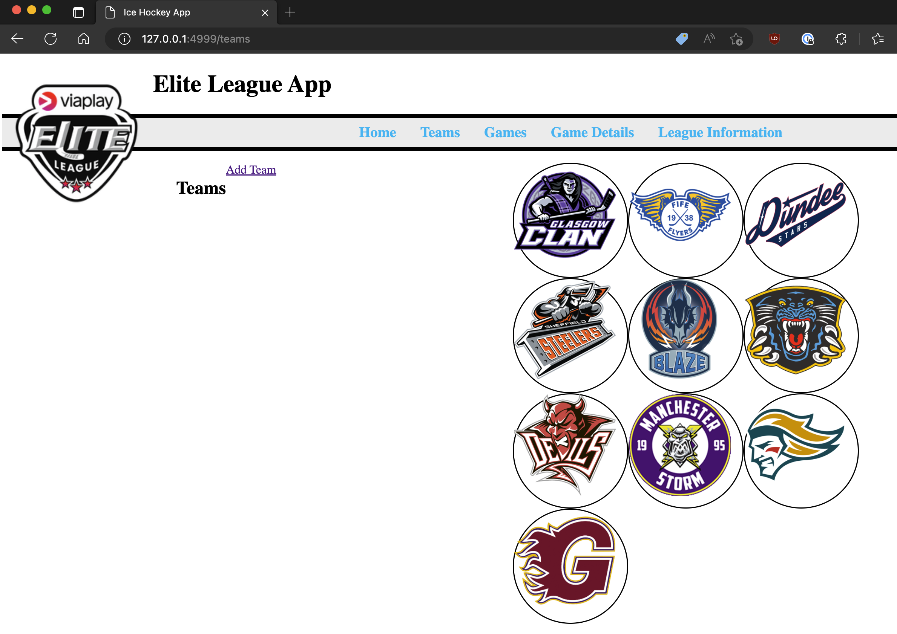

<h1 align="center"> Ice Hockey Tracker</h1>
<h2 align="center">



</h2>

## *1. Overview*
<h5> - Situation </h5>
consolidate and expand on everything learned Web Programming with Python
* Object oriented programming with Python
* Test Driven Development
* Web Programming (REST, MVC)
* Interacting with a PostgreSQL database (CRUD)

The Project must built uisng only:
* HTML / CSS
* Python
* Flask
* PostgreSQL and psycopg

<h5>- Task </h5>
<h4>Sports Scoring app</h4>
Build an app that lets a sport fan keep track of their favourite sports league.
MVP:
* The app should allow the user to create, edit and remove teams
* The user should be able to create new games
* There should be a way to display all the games for a team and all the teams involved in a game
* The app should display if a game was won or lost
Extensions:
* Create a league table to see who is on top of the league
* Add penalties / fouls with information on them.

<h5>- Action </h5>
Created an ice hockey tracking app that was based on the British Elite Ice hockey league.
in the documentation folder you will find my design images that I used when thinking about how this could be created. I also used multiple tables with many to many relations across the tables.

<h5>- Result </h5>
Presented the application at the end of the week to the class, demonstrating the Create, Read, Update and Delete (CRUD)functionality. also showed the design process where I was the only one in the class to use multiple tables and show the Many to many relationships through the app.

## *2. Set-up*
- Install Python3
- Install Flask, using Pip (package manager)
create folder
```sh
# terminal

mkdir my_web_app
cd my_web_app
```
then run the following command to install Flask
```sh
# terminal
pip3 install Flask
```
you will need PostgreSQL as this will host the database you will need.
[PostreSQL](https://www.postgresql.org)

to check that psql is installed, type the following.
```sh
# terminal
which psql   # this will show the path that postgresql was installed

psql       # this will launch the sql terminal


\q       # this will quit the sql terminal
```

## *3. Running the app*

- First, you will need to ensure that you have a database called hockey.

```sh
# terminal
dropdb hockey
createdb hockey
```

- Once you have created the database, you will need to run the hockey SQL file against it to create the tables.

```sh
# terminal
psql -d hockey -f ./db/icehockey.sql
```

- Once you have created the tables you then need to run the console.py file to populate the tables with the data that will help to run the application.

```sh
# terminal
python3 console.py
```
- now that you have the database populated and fully up and running you can run the Flask web server to get things up and running. from the Ice_hockey_tracker folder start flask from the terminal screen.

```sh
# terminal
flask run
```


